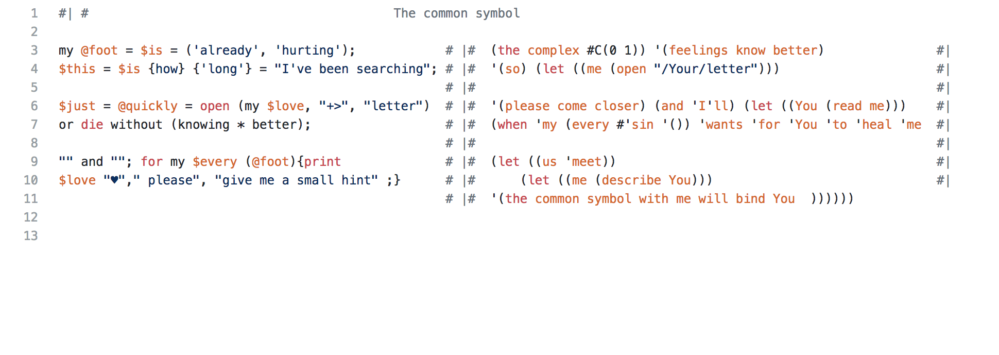
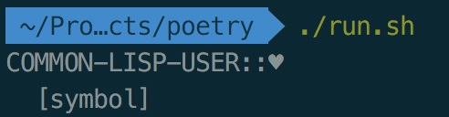

# The common symbol

This is a [polyglot](https://en.wikipedia.org/wiki/Polyglot_(computing)) poem wrote
as a submission for [Source Code Poetry](http://sourcecodepoetry.com/) competition.

The same code is valid (and should be ran to produce expected results)
in [perl](https://www.perl.org/) and [lisp](https://common-lisp.net/).

## The poem

Also see as [text](poem.txt), [perl syntax](perl.png) or [lisp syntax](lisp.png).

## Running

You obviously need both perl and lisp to run the code.

As the poem itself states, these two exchange some kind of letter - this is needed
to work correctly. So, the program should be first ran with `perl`, only then with `lisp`.

The easier way is to run provided [run.sh](run.sh), given you have Docker installed.

### The output

> **Warning!** Spoilers ahead

The output of the program, if ran correctly, gives the common symbol, binding us together.

### Whitespace

As they say, three's a crowd, but this program also runs on [whitespace](https://vii5ard.github.io/whitespace/).
